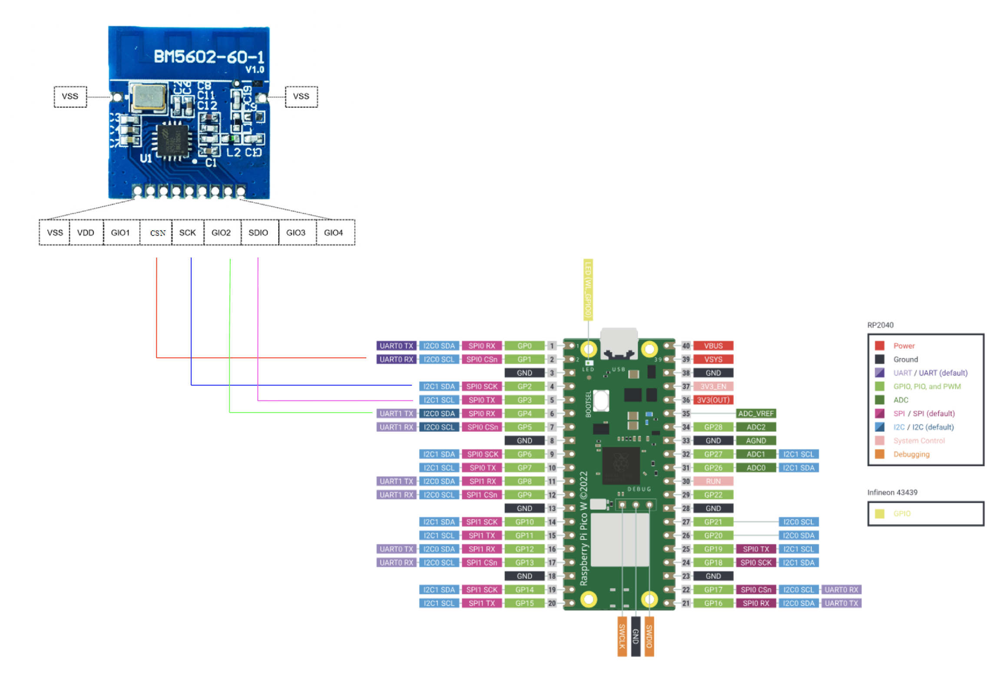
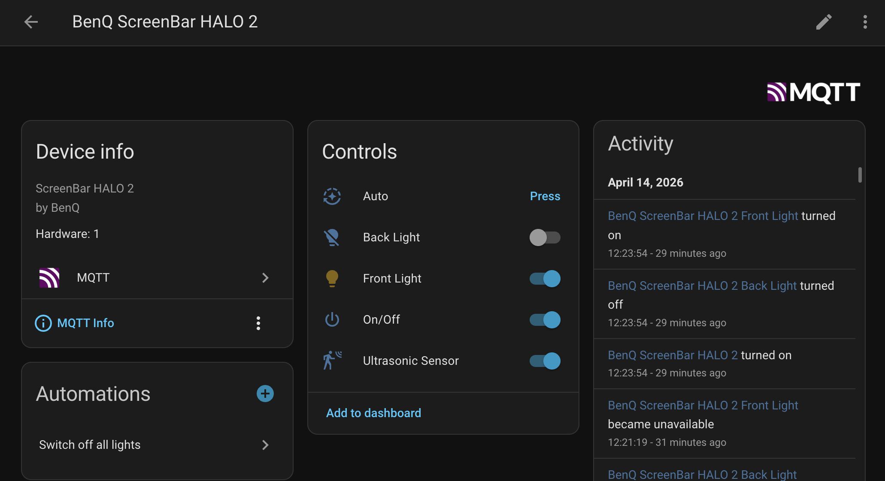
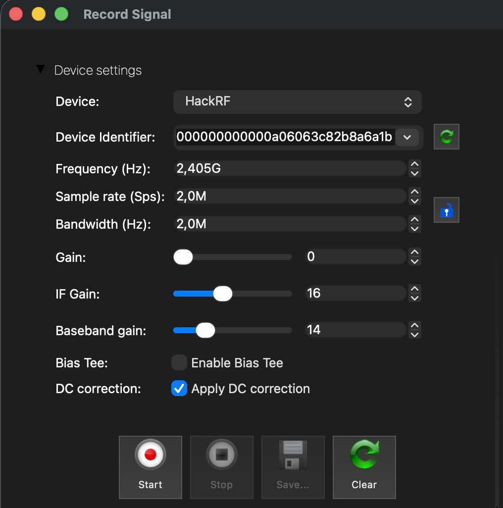
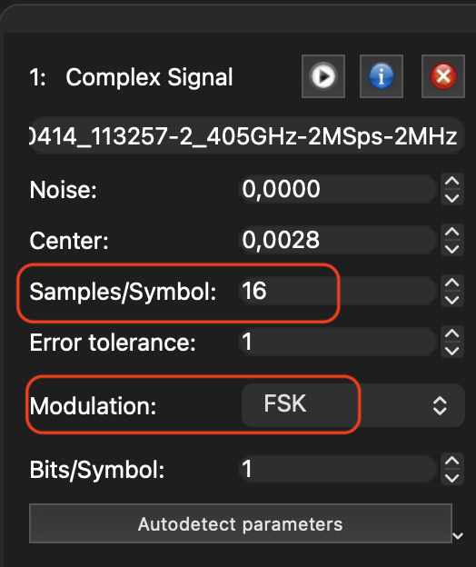
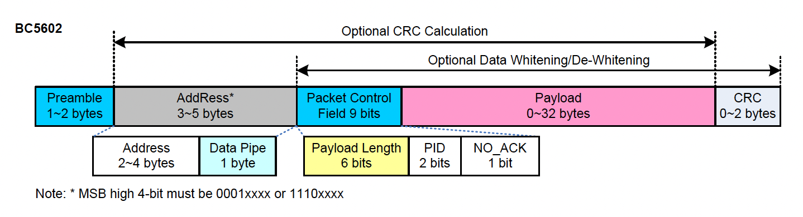
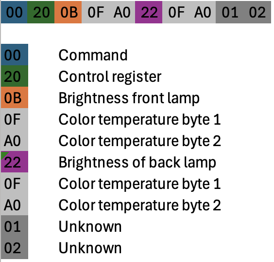
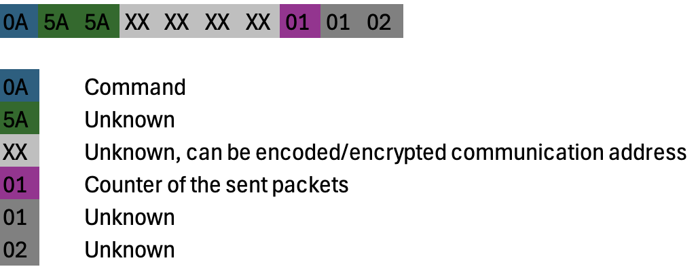

# BenQ ScreenBar HALO 2 - integration with Home Assistant

This is a fully functional PoC for integrating BenQ ScreenBar HALO 2 with Home Assistant.
The project is written on MicroPython and uses [MicroPython Asynchronous MQTT](https://github.com/peterhinch/micropython-mqtt) library by Peter Hinch, 
as well as ideas from [hatank](https://github.com/rguillon/hatank) by Renaud Guillon.

## Supported boards and layout

The same MicroPython application runs on Raspberry Pi **Pico W** and Seeed Studio
**XIAO ESP32C6**. The original ESP32-WROOM DevKit wiring remains available as a
third profile. A plain Pico without Wi-Fi cannot provide the MQTT integration.

```text
firmware/shared/             Shared lamp protocol, BC5602 driver, MQTT and utilities
boards/pico_w/              Pico W board_config.py
boards/xiao_esp32c6/         XIAO ESP32C6 board_config.py
boards/esp32_wroom/          Legacy ESP32-WROOM board_config.py
config/settings.example.py  Wi-Fi/MQTT configuration template
tools/build.py              Assemble a flat MicroPython upload bundle
tests/                      Host-side regression tests
build/<board>/              Generated files to upload (ignored by Git)
```

Both targets include all existing features: address acquisition and persistence,
Home Assistant MQTT discovery, master power, front and back light switching and
brightness, front color temperature (2700–6500 K), ultrasonic sensor control,
auto mode, five-second state polling, remote-control sniffing and the standalone
sniffer. The back light shares the front color temperature, as in the original.
The protocol and MQTT implementation are shared to keep both targets in parity.

## Hardware and wiring

Every board requires a **BM5602-60-1 external transceiver**. The ESP32C6's built-in
Wi-Fi/Bluetooth/802.15.4 radio does not replace it. Power the transceiver from
**3.3 V**, and connect a common ground. This is the module's normal operating
voltage: its specified VDD range is **1.9–3.6 V**, and its electrical
characteristics are measured at 3.3 V. The module typically draws about 17 mA
while receiving and 25 mA while transmitting at 5 dBm. The XIAO's 3V3 pin is a
regulated output rated by Seeed for up to 700 mA, so it has ample capacity for
the BM5602 when the XIAO is powered normally. The 3.6 V figure is an operating
limit, not permission to use the 5V pin. Because the MCU and module both use the
same 3.3 V rail, no logic-level shifter is required on the SPI connections.

| BM5602-60-1 module pin | Signal direction | Pico W | XIAO ESP32C6 | ESP32-WROOM DevKit |
|------------------------|------------------|--------|----------------|-------------------|
| Pin 4 — CSN | MCU → BM5602 | GP1, physical pin 2 | D10 / GPIO18 | GPIO5 |
| Pin 5 — SCK | MCU → BM5602 | GP2, physical pin 4 | D9 / GPIO20 | GPIO18 |
| Pin 7 — SDIO | MCU → BM5602 (MOSI) | GP3, physical pin 5 | D8 / GPIO19 | GPIO23 |
| Pin 6 — GIO2 | BM5602 → MCU (MISO on Pico/WROOM) | GP4, physical pin 6 | Unconnected | GPIO19 |
| Pin 9 — GIO4 | BM5602 → MCU (MISO on XIAO) | Unconnected | D7 / GPIO17 | Unconnected |
| Pin 1 — VSS | Power | GND, physical pin 3 | GND | GND |
| Pin 2 — VDD | Power | 3V3 OUT, physical pin 36 | 3V3 | 3V3 |

Use the labels printed on the XIAO board; the GPIO number is included only to
cross-check the label. Board drawings can be shown from either side, so do not
infer the connections from left/right position alone. Do **not** connect BM5602
VDD to the XIAO 5V pad.

The driver uses four-wire SPI mode 0 at **4 MHz**, below the BM5602's specified
8 Mbps maximum and more tolerant of jumper-wire signal quality. SDIO is MOSI
despite its name. The XIAO profile uses **GIO4 as MISO** and routes the SPI signals
to D10/D9/D8/D7 to simplify wiring. The ESP32C6 GPIO matrix supports this mapping;
the board's printed SPI function labels are defaults, not fixed assignments.
Pico W and ESP32-WROOM retain **GIO2 as MISO**. Leave GIO1, GIO3 and the unused
GIO2 or GIO4 unconnected.

The shared driver selects the radio output using `RADIO_MISO_GIO` in the board
profile: XIAO uses IO1=`0x40`, IO2=`0x10`; Pico/WROOM use IO1=`0x48`, IO2=`0x00`.
This selection is applied during initialization, polling, acquisition and
sniffing. If upgrading a XIAO from the previous D7/D8/D10/D9 + GIO2 wiring,
rewire it using the table and upload a newly built XIAO bundle before use.
If using the earlier GIO3-to-D7 wiring, move that wire to **BM5602 GIO4 (pin 9)**
and upload the updated bundle. The XIAO end remains **D7 / GPIO17**.

Keep SPI wires short, place the module at least 1 cm from metal around its
antenna, and use a stable 3.3 V supply with local decoupling near the module.
XIAO GPIO numbers and D labels differ: for example **D3 is GPIO21**, not GPIO3.
The XIAO profile selects the onboard ceramic Wi-Fi antenna using GPIO3 low and
GPIO14 low, and uses the active-low user LED on GPIO15. See
[Seeed's board pin map and antenna documentation](https://wiki.seeedstudio.com/xiao_esp32c6_getting_started/).
Pico wiring illustration:



## Quick start

1. Wire the BM5602 according to the table above.
   Before applying power, verify that VDD goes only to 3V3, VSS goes to GND,
   and there are no shorts between adjacent module pads. At first boot, a valid
   SPI link prints `Chip version: ...`; `Transceiver BM5602 not found!` usually
   means CSN, SCK, SDIO/MOSI or the selected GIO/MISO is swapped or disconnected.
2. Install MicroPython for your board:
   - [Pico W firmware](https://micropython.org/download/RPI_PICO_W/): hold BOOTSEL while plugging in USB, then copy the UF2 onto the mounted drive.
   - [ESP32_GENERIC_C6 firmware](https://micropython.org/download/ESP32_GENERIC_C6/): use the **C6** firmware and follow that page's flashing instructions. Hold BOOT while connecting USB if needed to enter the bootloader. Standard ESP32, C3 and S3 images are different targets.
   - [Legacy ESP32-WROOM firmware](https://micropython.org/download/ESP32_GENERIC/).
3. Copy `config/settings.example.py` to `config/settings.py`, and enter your Wi-Fi
   and MQTT credentials. This local file and generated bundles are ignored by Git.
4. Build the desired bundle on your computer (Python 3, no build dependencies):

   ```sh
   python3 tools/build.py xiao_esp32c6
   # Or:
   python3 tools/build.py pico_w
   ```

   Use `esp32_wroom` for the legacy DevKit. An alternative settings file can be
   supplied with `--settings /path/to/settings.py`. Building replaces that board's
   generated directory; make source/configuration edits outside `build/`.
5. Copy **the contents** of `build/<board>/` to the MCU filesystem root using
   Thonny or `mpremote`. For example, with `mpremote` installed and the XIAO on
   `/dev/ttyACM0`:

   ```sh
   mpremote connect /dev/ttyACM0 fs cp -r build/xiao_esp32c6/. :
   mpremote connect /dev/ttyACM0 reset
   ```

   Adjust the port and board directory as needed. Uploading preserves an existing
   `halo2_address.py` because bundles do not include it. When upgrading the old
   `src/` deployment, migrate credentials from `benq_halo/halo_mqtt.py` into
   `config/settings.py` first. All bundles need both `board_config.py` and
   `settings.py` in the device root; do not copy `firmware/shared/` alone.
6. If no valid lamp address is saved, use the remote to set the **back brightness
   to 10%** and **color temperature to 3925 K**. Acquisition saves
   `/halo2_address.py` and reboots before connecting to MQTT. To use another lamp,
   delete that file on the MCU and restart to reacquire its address.
7. Home Assistant MQTT discovery creates the lamp entities. The user LED indicates
   Wi-Fi connection status. The standalone `sniffer.py` and
   `find_halo2_address.py` remain available on both boards; interrupt `main.py`
   before running them through the REPL or `mpremote`.

## Validation

Run `python3 -m unittest discover -s tests -v` on the host. Tests check board
pin selection, LED polarity, antenna setup, address validation, remote packet
decoding, and identical SPI command traffic for the Pico W and XIAO controls.
These are simulated hardware tests; the XIAO port still requires physical
validation with a BM5602 and HALO 2 before claiming hardware-tested parity.

On each board, check address acquisition across a reboot, all five Home Assistant
entities (including brightness and temperature), remote changes reflected in HA,
five-second polling, Wi-Fi/MQTT disconnect and reconnect, and standalone sniffing.
The original synchronous radio retries can delay MQTT processing for several
seconds while the lamp settles; avoid rapid successive commands.



NB! The lamp changes values gradually, which takes time, and it is easy to confuse it by rapidly changing the state in HA.
The On/Off switch powers off the both front- and back- lights and will try to prevent them from changing until the lamp is turned on again.

## Technical details

In FCCID report for the Halo 2 mentioned three radio channels, but I observed communication only on channel 1.
The modulation is GFSK and the data rate is 125 Kbps.

* Channel 1 -> 2405 MHz (default)
* Channel 2 -> 2446
* Channel 3 -> 2475

The address during the pairing process is **E2 08 00 B0**, but the communication address is most likely transferred during pairing process in an encoded or encrypted form.

To find the communication address, you can use:
* The python script **find_halo2_address.py**, which should be run on either supported MCU. This will be done automatically, when the `halo2_address.py` file is absent.
* [HackRF One](https://en.wikipedia.org/wiki/HackRF_One) and [Universal Radio Hacker (URH)](https://github.com/jopohl/urh)

### Find communication address using Python script

The script **find_halo2_address.py** will attempt to find HALO2_ADDRESS (the address or sync word which used to communicate with the Halo 2 lamp).
You need to start this script on the MCU and set the following parameters on the Halo 2 remote control:
* Set the brightness of back lamp to 10%
* Set the color temperature to 3925K

The HALO2_ADDRESS will be saved to the `halo2_address.py` file in the root folder of the MCU.

### Find communication address using HackRF One

#### Starting to capture the RF signal in URH


#### Decoding the captured RF signal in URH


### RF packet format


Ref to the BC5602 datasheet, the packet starts with preamble **10101010** and has 4-byte address, **9 bits PCF** and a dynamic payload length, but always 10 bytes.

### Payload


The payload is 10 bytes. The first byte is a command, followed by a control register where each bit corresponds to an entity.
Then comes brightness for the front lamp, two bytes of color temperature, brightness for the back lamp and the color temperature.
The payload ends with **01 02** in my case. It doesn't appear that color temperature can be changed for the back lamp, so both lamps share the same value.

#### Control register

| Bit number | Description       |
|------------|-------------------|
| 0          | On/Off            |
| 1          | Auto              |
| 2          | Favorit           |
| 3          | Back lamp on      |      
| 4          | Both lamps on     |      
| 5          | Ultrasonic sensor |     
| 6          | Not in use ?      |     
| 7          | Not in use ?      |     

#### Payload commands

* 00 - Remote control wakes up and contacts the lamp
* 02 - On/off light
* 03 - Change brightness and color temperature
* 04 - Sync lamp state
* 05 - Remote control goes to sleep and informs the lamp
* 0A - Paring mode

#### Brightness
The brightness ranges from 1% to 100%, corresponding to values from 0x01 to 0x64.

#### Color temperature
The color temperature ranges from 2700K to 6500K, corresponding to values from **0x0A8C** to **0x1964**.
For example, 4000K is transferred as **byte 1 = 0x0F**, **byte 2 = 0xA0**.

### Pairing process
During pairing uses address **E2 08 00 B0** for communication between remove control and the lamp.
The packet also has a 10‑byte payload, but some fields differ.
The command field is always **0x0A**, and the payload ends with bytes **01 02** in my case.
The unknown bytes appear static and may be related to communication address used in normal mode.


## Auto-ACK and No-Auto-ACK modes of BC5602
The HALO 2 remote control and the lamp operates in standard mode with the Auto-ACK feature. This means that when remote control sends an RF-packet,
the lamp automatically replies with an ACK packet. The BC5602 in the integration device behaves the same when changing og requesting status from the lamp.
The lamp itself does not report status proactively; it communicates only through ACK packets.
To track the current state, the integration device must poll the lamp every 5 seconds. At the same time, it attempts to sniff packets from the remote control.
This is more complicated, because the integration device must disable Auto-ACK; otherwise, the remote control will not reach the lamp.
Disabling Auto-ACK also disabling dynamic payload length feature and CRC, so the integration device must process the Packet Control Field and adjust the payload to one bit, since the PCF is 9 bits long.
